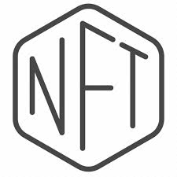

    

<h1 align="center">Senior Web and Blockchain Developer</h1>  

- 👨‍💻 A ambitious Web and Blockchain Developer seeking an opportunity to work with a team that can utilize my ability to produce creative solutions.
- 🏆 Always provides very creative ideas and has high passion, high ability, clean coding ability
- 📚 Dedicated to growth in technology and enjoy learning new languages and systems.
- ⚡ Deeply knowledge in distributed ledger, blockchain security, blockchain architecture patterns, and different blockchain standards and ecosystems.
- 💎 What makes me better than anyone else is punctuality and honesty

<table>
	<tr>
		<td valign="top" width="33%">
			

				<h6> <b> Full Stack </b> </h6>
			

			
  
			
			
			
			
				
				
				  
				
				
				
				 
				
			

		</td>
		<td valign="top" width="33%">
			

					<h6><b>DevOps toolchain</b></h6>
				

			
 
				
				 
				
				
				
				
				 
				
			

		</td>
		<td valign="top" width="33%">
			

				<h6><b>BlockChain</b></h6>
			

			

			    
			    
			    
			    
			    
			    
			    
			    
			    
			    
			    
			    
			

		</td>
	</tr>
</table>

  

