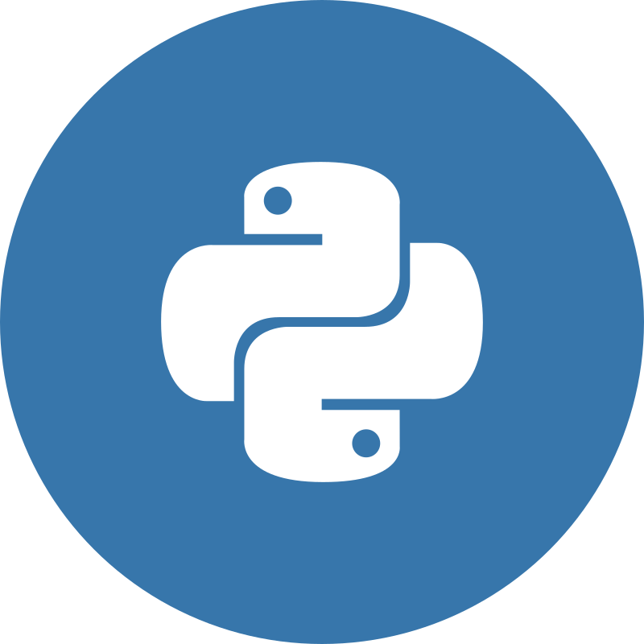

<table>
<tr>
<td>

<h1 align="center">Web & Ecommerce Shopify Developer</h1>

<!-- Talking about you -->

**Talking about Personal Stuffs:**

<!-- Any image aligned to the right. Beware the width -->

- 🏆 Always provides very creative ideas and has high passion, high ability, clean coding ability.
- 📚 Dedicated to growth in technology and enjoy learning new languages and systems.
- 👨🏽‍💻 A persistent performer with strong attention to best practices and edge technologies.
- 💬 Ask me about anything, I am happy to help.
- ⚡️ I will bring to life all your ideas!

</td>
</tr>
</table>

   
  
  
  
   
  
  
  
  
  
  
  
  
  
  

